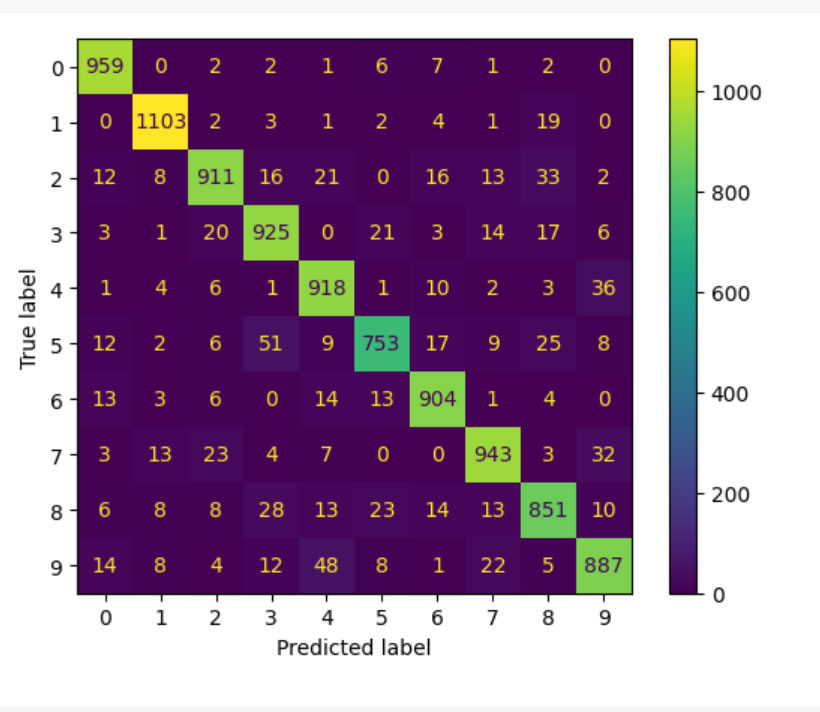

# Cálculo de Métricas de Avaliação de Aprendizado

No desafio do quarto módulo do Bootcampo BairesDev - Machine Learning Practitioner promovido pela DIO chamado "Cálculo de Métricas de Avaliação de Aprendizado" foi feito o cálculo das principais métricas para avaliação de modelos de classificação de dados, como acurácia, sensibilidade (recall), especificidade, precisão e F-score. O código foi implementado no Google Colab.

Bibliotecas utilizadas:

- Tensorflow
- Pandas
- Matplotlib
- Sklearn

## Dataset 

Foi utilizado no desafio o dataset MNIST. O conjunto de dados MNIST (Modified National Institute of Standards and Technology) é uma grande base de dados de dígitos manuscritos que é normalmente utilizada para treinar vários sistemas de processamento de imagem e modelos de aprendizagem automática. Foi criado através da "re-mistura" das amostras dos conjuntos de dados originais do NIST e tornou-se uma referência para avaliar o desempenho dos algoritmos de classificação de imagens.

A MNIST contém 60.000 imagens de treino e 10.000 imagens de teste de dígitos manuscritos.
O conjunto de dados inclui imagens em escala de cinza de 28x28 pixels.

##  Matriz de confusão

Uma matriz de confusão é uma ferramenta usada em machine learning para avaliar o desempenho de um modelo de classificação. Ela mostra como as previsões do modelo se comparam aos valores reais em um formato tabular.

A matriz de confusão é uma tabela n×n, onde n é o número de classes no conjunto de dados. Para o caso mais comum de duas classes (binário), a matriz tem 2x2 e é organizada assim:

|                  | **Previsto: Positivo** | **Previsto: Negativo** |
|------------------|------------------------|------------------------|
| **Real: Positivo** | Verdadeiro Positivo (VP) | Falso Negativo (FN)   |
| **Real: Negativo** | Falso Positivo (FP)      | Verdadeiro Negativo (VN) |

## Definições

**Verdadeiro Positivo (VP)**: O modelo previu positivo, e a classe verdadeira era positiva.
**Verdadeiro Negativo (VN)**: O modelo previu negativo, e a classe verdadeira era negativa.
**Falso Positivo (FP)**: O modelo previu positivo, mas a classe verdadeira era negativa.
**Falso Negativo (FN)**: O modelo previu negativo, mas a classe verdadeira era positiva.

## Métricas derivadas

